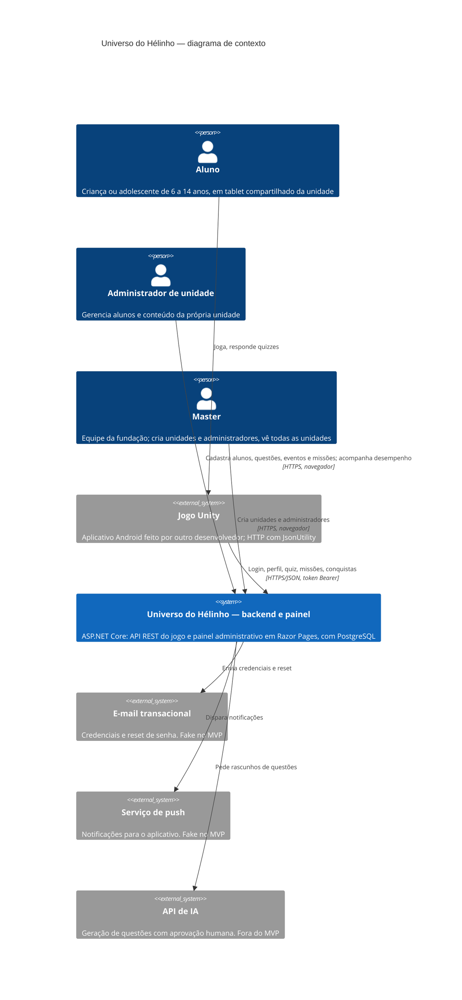

# C4 — Contexto: universo-do-helinho

```mermaid
C4Context
    title Universo do Hélinho — diagrama de contexto

    Person(aluno, "Aluno", "Criança ou adolescente de 6 a 14 anos, em tablet compartilhado da unidade")
    Person(admin, "Administrador de unidade", "Gerencia alunos e conteúdo da própria unidade")
    Person(master, "Master", "Equipe da fundação; cria unidades e administradores, vê todas as unidades")

    System_Ext(jogo, "Jogo Unity", "Aplicativo Android feito por outro desenvolvedor; HTTP com JsonUtility")
    System(helinho, "Universo do Hélinho — backend e painel", "ASP.NET Core: API REST do jogo e painel administrativo em Razor Pages, com PostgreSQL")

    System_Ext(email, "E-mail transacional", "Credenciais e reset de senha. Fake no MVP")
    System_Ext(push, "Serviço de push", "Notificações para o aplicativo. Fake no MVP")
    System_Ext(ia, "API de IA", "Geração de questões com aprovação humana. Fora do MVP")

    Rel(aluno, jogo, "Joga, responde quizzes")
    Rel(jogo, helinho, "Login, perfil, quiz, missões, conquistas", "HTTPS/JSON, token Bearer")
    Rel(admin, helinho, "Cadastra alunos, questões, eventos e missões; acompanha desempenho", "HTTPS, navegador")
    Rel(master, helinho, "Cria unidades e administradores", "HTTPS, navegador")
    Rel(helinho, email, "Envia credenciais e reset")
    Rel(helinho, push, "Dispara notificações")
    Rel(helinho, ia, "Pede rascunhos de questões")
```

No MVP o sistema roda localmente e os três serviços externos à direita são implementações fake dentro do próprio backend.
